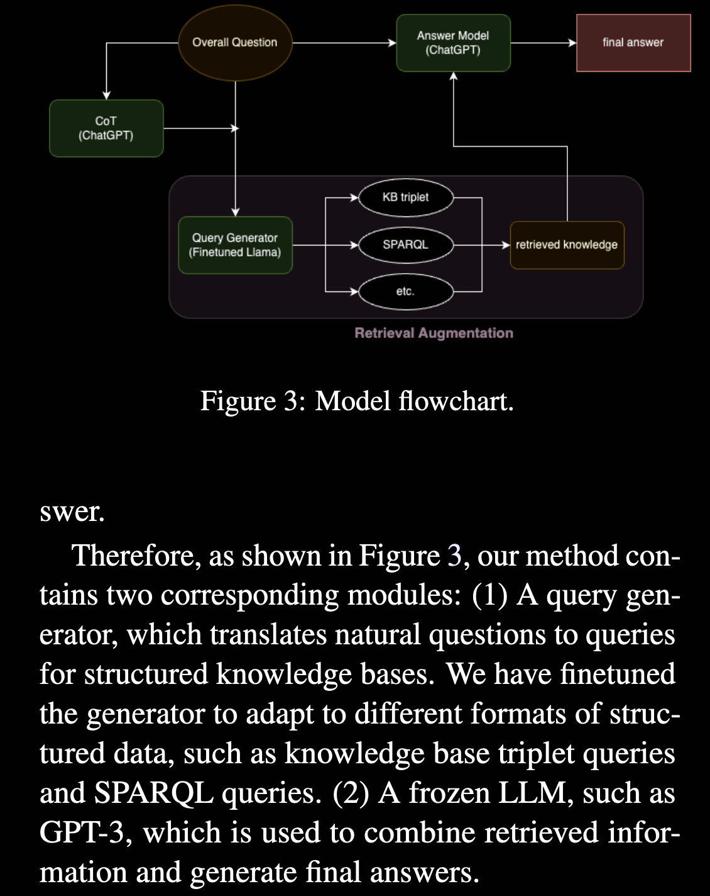

# Chain of Knowledge: A Framework for Grounding Large Language Models with Structured Knowledge Bases
- [paper](http://arxiv.org/abs/2305.13269)
- [code](https://github.com/DAMO-NLPSG/chain-of-knowledge)

2024.11.25 Liu.

## 任务概述
大模型从训练数据中记忆知识的能力很强，相应的更新或控制大模型的知识就比较困难
研究如何提高大语言模型的事实正确性，减少幻觉

## 背景
1. 大语言模型的发展  
2. NLP领域的知识密集型任务：当一项任务超出了人类在没有获得外部知识的情况下解决该任务的能力的合理预期时，该任务被视为知识密集型任务。  
在本工作中这一定义被拓宽了一下：这些任务不仅需要基本的语言能力，还需要整合知识，无论是事实还是基于常识，以有效解决给定的问题   
简单讲就是需要对常识和事实进行推理整合的相对复杂的任务
3. 增强语言模型：通过为传统 LLM 提供改进的推理能力和利用外部资源的能力来解决传统 LLM 的局限性，如生成看似合理但实际上不正确的答案，或者说幻觉，以及特定专业领域知识不足

## 相关工作
1. 为模型引入外部知识，如网页文档、知识库等
2. CoT (Chain of Thought)：在知识密集任务上，如需要通过多个事实进行推理的任务上，可以通过让模型给出中间步骤从而完成更复杂的任务

## 方法
CoK (Chain of Knowledge)框架：结合逐步推理与知识库检索，将大问题拆分为子问题，为每个子问题从外部知识库中检索相关事实，让大语言模型结合这些事实进行推理解答。

不一样的地方：由于大模型在文本数据上预训练，并未针对结构化查询数据做优化，因此本文设计了一个查询生成器模型，帮助 LLM 生成准确的知识库查询。
？？？就这？？？
