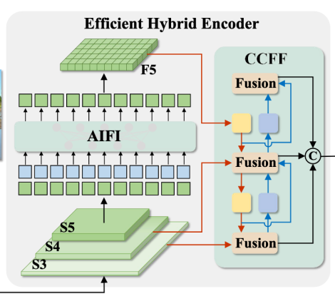
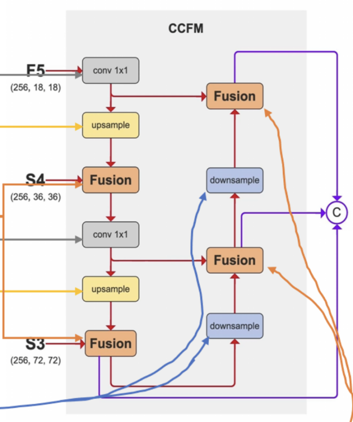
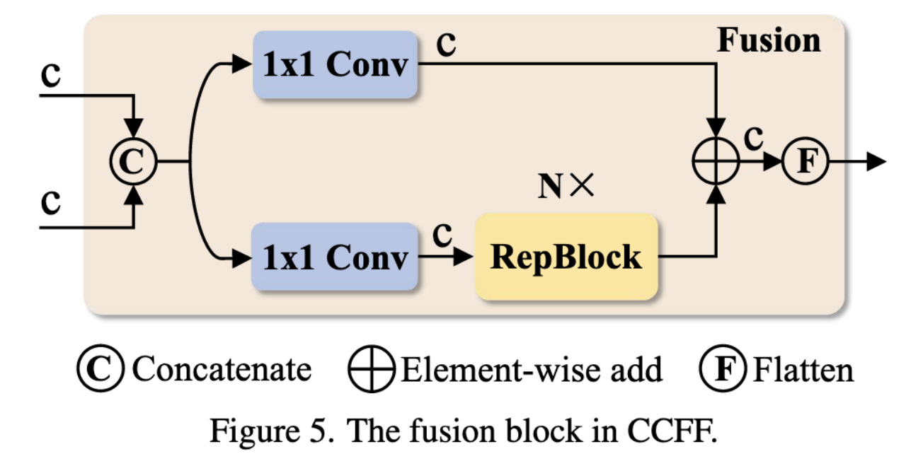
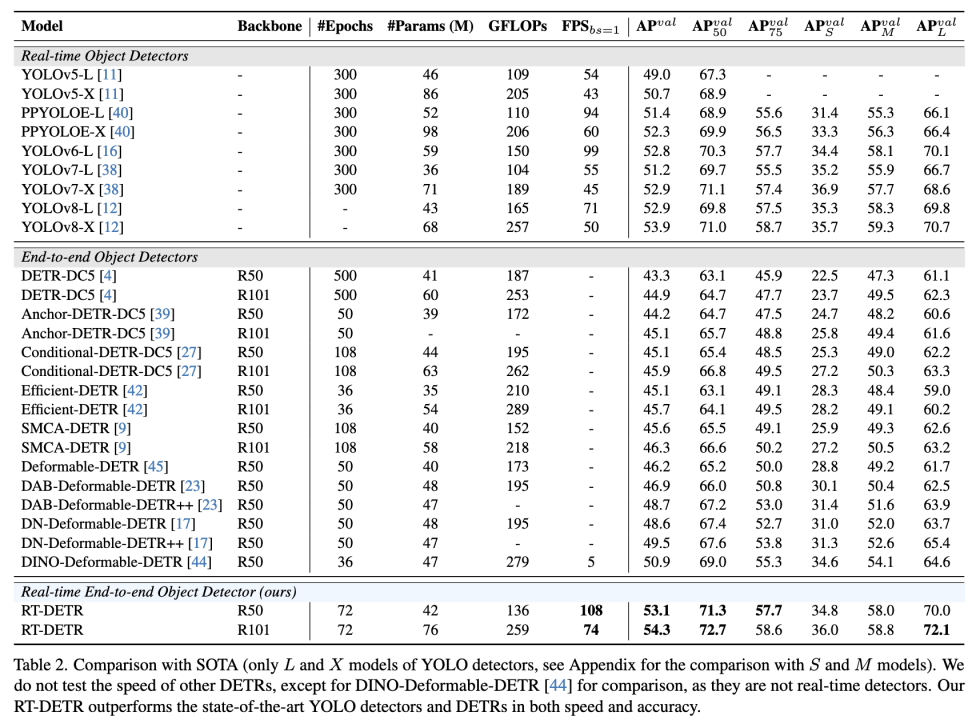

# DETRs Beat YOLOs on Real-time Object Detection
- [paper](http://arxiv.org/abs/2304.08069)
- [code](https://zhao-yian.github.io/RTDETR)

2024.11.28 Liu.

## 任务概述
目前实时目标检测最著名的是基于 CNN 的 YOLO 系列模型，这类模型使用非极大值抑制（NMS）来过滤预测框，这样的后处理操作拖慢了检测速度，引入的超参数也造成了速度和准确率的不稳定  

端到端目标检测 DETR 省去了 NMS 的后处理操作，但计算量大，速度慢，多尺度特征加速了收敛，但多尺度特征交互带来的计算开销成为了速度瓶颈；在准确性方面，DETR 使用的初始查询仅考虑了分类分数，没有位置信息

任务：提高 DETR 的速度，保持或改进准确率

## 背景
1. 实时目标检测 基本被 YOLO 系列统治  

2. DETR 是端到端目标检测，采用二分匹配并直接预测一对一的对象集，但有三个问题：  
    - 训练收敛慢
    - 计算成本高
    - 查询难以优化

一些改进工作，待阅读：
- 加速融合：Deformable-DETR 通过提高注意力机制的效率，加速了具有多尺度特征的训练收敛。DAB-DETR 和 DN-DETR 通过引入迭代细化方案和去噪训练进一步提高性能。Group-DETR 引入了分组一对多赋值。
- 降低计算成本： Efficient DETR和Sparse DETR 通过减少编码器和解码器层的数量或更新的查询数量来降低计算成本。Lite DETR 通过以交错方式降低低级特征的更新频率来提高编码器的效率。
- 优化查询初始化：Conditional DETR 和 Anchor DETR 降低了查询的优化难度。Zhu et al.提出了两阶段 DETR 的查询选择，DINO 建议混合查询选择以帮助更好地初始化查询。

## 方法

### 模型结构

关键点：
1. 设计了一种高效的混合编码器，通过解耦尺度内交互和跨尺度融合来快速处理多尺度特征，以提高速度。

2. 提出不确定性最小查询选择，为解码器提供高质量的初始查询，从而提高准确性。

3. 支持灵活的速度调整，通过调整解码器层数来适应各种场景，而无需重新训练。

#### 高效混合编码器
基于注意力的尺度内特征交互（AIFI）和基于CNN的跨尺度特征融合（CCFF）  
  
将自注意力操作应用于具有更丰富语义概念的高级特征，捕获了概念实体之间的联系，这有利于后续模块对对象的定位和识别。然而，由于缺乏语义概念以及高层特征交互存在重复和混淆的风险，低层特征的尺度内交互是不必要的。  
  

融合块的作用是将两个相邻的尺度特征融合成一个新的特征    
#### 不确定性最小查询选择
DETR中的目标查询是一组可学习的嵌入，这些嵌入由解码器优化，并由预测头映射到分类分数和边界框。然而，这些目标查询很难解释和优化，因为它们没有明确的物理意义。后续工作改进了目标查询的初始化，并将其扩展到内容查询和位置查询（Anchor点）。其中，Effificient detr、Dino以及Deformable detr都提出了查询选择方案，它们的共同点是利用分类得分从编码器中选择Top-K个特征来初始化目标查询（或仅位置查询）。然而，由于分类得分和位置置信度的分布不一致，一些预测框具有高分类得分，但不接近GT框，这导致选择了分类得分高、IoU得分低的框，而分类得分低、IoU分数高的框被丢弃。这会削弱探测器的性能。为了解决这个问题，作者提出了IoU-Aware查询选择，通过约束模型在训练期间为具有高IoU分数的特征产生高分类分数，并为具有低IoU得分的特征产生低分类分数。  

### 实验结果

